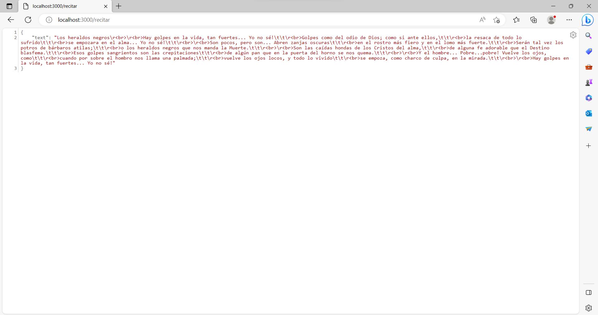

<table>
    <theader>
        <tr>
            <td></td>
            <th>
                UNIVERSIDAD NACIONAL DE SAN AGUSTIN 
                FACULTAD DE INGENIERÍA DE PRODUCCIÓN Y SERVICIOS 
                DEPARTAMENTO ACADÉMICO DE INGENIERÍA DE SISTEMAS E INFORMÁTICA 
                ESCUELA PROFESIONAL DE INGENIERÍA DE SISTEMAS
            </th>
            <td></td>
        </tr>
    </theader>
    <tbody>
        <tr><td colspan="3">Formato: Práctica de Laboratorio</td></tr>
        <tr><td>Aprobación:  2022/03/01</td><td>Código: GUIA-PRLD-001</td><td>Página: 1</td></tr>
    </tbody>
</table>

GUÍA DE LABORATORIO 

<table>
<theader>
<tr><th colspan="6">INFORMACIÓN BÁSICA</th></tr>
</theader>
<tbody>
<tr><td>ASIGNATURA:</td><td colspan="5">Programación Web 2</td></tr>
<tr><td>TÍTULO DE LA PRÁCTICA:</td><td colspan="5">Ayax y NodeJSt</td></tr>
<tr>
<td>NÚMERO DE PRÁCTICA:</td><td>03</td><td>AÑO LECTIVO:</td><td>2023 A</td><td>NRO. SEMESTRE:</td><td>III</td>
</tr>
<tr>
<td>FECHA INICIO:</td><td>09-May-2022</td><td>FECHA FIN:</td><td>13-May-2022</td><td>DURACIÓN:</td><td>04 horas</td>
</tr>
<tr><td colspan="6">INTEGRANTES:
    <ul>
        <li>Forocca Mamani Maxs Sebastian Joaquin</li>
    </ul>
</td>
</<tr>
<tr><td colspan="6">DOCENTE:
<ul>
<li>Anibal Sardon</li>
</ul>
</td>
</<tr>
</tdbody>
</table>

#

## EJERCICIOS PROPUESTOS
- Ejercicio 01
  - Ejecucion del Ejercicio 01
  -
- Ejercicio 02
  - Ejecucion del Ejercicio 02
  -
- Ejercicio 03
  - Ejecucion del Ejercicio 03
  -
- Ejercicio 04 
  - Ejecucion del Ejercicio 04
    - En 'http://localhost:3000'
  -
    - En 'http://localhost:3000/recitar'
  -
#

## CUESTIONARIO

#

## REFERENCIAS

#
