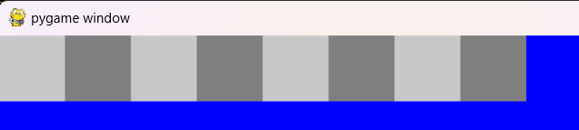

<table>
    <theader>
        <tr>
            <td></td>
            <th>
                UNIVERSIDAD NACIONAL DE SAN AGUSTIN 
                FACULTAD DE INGENIERÍA DE PRODUCCIÓN Y SERVICIOS 
                DEPARTAMENTO ACADÉMICO DE INGENIERÍA DE SISTEMAS E INFORMÁTICA 
                ESCUELA PROFESIONAL DE INGENIERÍA DE SISTEMAS
            </th>
            <td></td>
        </tr>
    </theader>
    <tbody>
        <tr><td colspan="3">Formato: Práctica de Laboratorio</td></tr>
        <tr><td>Aprobación:  2022/03/01</td><td>Código: GUIA-PRLD-001</td><td>Página: 1</td></tr>
    </tbody>
</table>

GUÍA DE LABORATORIO 

<table>
<theader>
<tr><th colspan="6">INFORMACIÓN BÁSICA</th></tr>
</theader>
<tbody>
<tr><td>ASIGNATURA:</td><td colspan="5">Programación Web 2</td></tr>
<tr><td>TÍTULO DE LA PRÁCTICA:</td><td colspan="5">Python</td></tr>
<tr>
<td>NÚMERO DE PRÁCTICA:</td><td>04</td><td>AÑO LECTIVO:</td><td>2023 A</td><td>NRO. SEMESTRE:</td><td>III</td>
</tr>
<tr>
<td>FECHA INICIO:</td><td>30-May-2022</td><td>FECHA FIN:</td><td>5-Jun-2022</td><td>DURACIÓN:</td><td>04 horas</td>
</tr>
<tr><td colspan="6">INTEGRANTES:
    <ul>
        <li>Forocca Mamani Maxs Sebastian Joaquin</li>
    </ul>
</td>
</<tr>
<tr><td colspan="6">DOCENTE:
<ul>
<li>Aníbal Sardón</li>
</ul>
</td>
</<tr>
</tdbody>
</table>

#

## EJERCICIOS PROPUESTOS
- En esta tarea usted pondrá en práctica sus conocimientos de programación en Python para dibujar un tablero de Ajedrez.

- La parte gráfica ya está programada, usted sólo tendrá que concentrarse en las estructuras de datos subyacentes.

- Con el código proporcionado usted dispondrá de varios objetos de tipo Picture para poder realizar su tarea:

- Estos objetos estarán disponibles importando la biblioteca: chessPictures y estarán internamente representados con arreglos de strings que podrá revisar en el archivo pieces.py

- La clase Picture tiene un sólo atributo: el arreglo de strings img, el cual contendrá la representación en caracteres de la figura que se desea dibujar.

- La clase Picture ya cuenta con una función implementada, no debe modificarla, pero si puede usarla para implementar sus otras funciones: 
  - _invColor: recibe un color como un caracter de texto y devuelve su color negativo, también como texto, deberá revisar el archivo colors.py para conocer los valores negativos de cada caracter.
- La clase Picture contará además con varios métodos que usted deberá implementar:
  - verticalMirror: Devuelve el espejo vertical de la imagen
    - En el metodo vericalMirror: Se crea un Picture 'rpta' y se una lista 'vertical' que agregara Strings con los caracteres cambiados de orden de 'self.img' usando 'vertical.append(self.img[::-1])' y se agrega a 'rpta' retornandose este ultimo.
  
  - horizontalMirror: Devuelve el espejo horizontal de la imagen
    - En el metodo horizontalMirror: Se crea un lista 'horizontal' donde se agregaran los elementos de la lista 'self.img' pero en orden cambiado, el ultimo primero, y finalmente retorna la lista 'horizontal'.
  
  - negative: Devuelve un negativo de la imagen
    - El metodo negative: Crea una lista 'nega' donde se iran añadiendo los elementos del 'self.img' pero con los caracteres cambiados a su inverter, se usan dos bucles for, el primero itera cada elemento de la lista 'self.img' y tambien crea un String vacio 'str'. El segundo bucle itera entre cada caracter del elemento del primer bucle y se agregan a 'str' los caracteres que devuelve la funcion _invColor. Despues 'str' se agrega a 'nega' que a su ves se manda como parametro a un nuevo Picture 'negativo', finalmente se retorna 'negativo'.
  
  - join: Devuelve una nueva figura poniendo la figura del argumento al lado derecho de la figura actual
    - El metodo join: Crea un Picture 'rpta' con la lista de 'self' y se crea un bucle for que iterara entre el rango de 0 y la longitud de 'self.img', en el bucle se agregaran a cada String de 'rpta.img' los String de 'p.img' que es uno de los argumentos. Finalemnte se retorna 'rpta'.
  
  - up: Devuelve una nueva figura poniendo la figura recibida como argumento, encima de la figura actual
    - El metodo up: Crea un Picture 'rpta' similar al del metodo join. Tambien crea un bucle for que itera entre 0 y la longitud de 'p.img', en el bucle se agragan los elementos de 'p.img' debajo de 'rpta.img' usando append. Finalmente se retorna 'rpta'.
  
  - under: Devuelve una nueva figura poniendo la figura recibida como argumento, sobre la figura actual
    - El metodo under: Crea una lista vacia 'arrayCombinado', tambien se itera simultaneamente con un for cadena1 y cadena2 de 'zip(self.img, p.img)', posteriio a ello se crea un String vacio str y otro for que itera simultaneamente a char1 y char2 de 'zip(cadena1, cadena2)'. Dentro del segundo bucle se compara que 'char2' sea diferente de ' ', pues este el color de fondo y se agrega 'char1' a 'str', sino se agregara 'char2'. Posterior a esto se agrega 'str' a 'arrayCombinado' y se crea un Picture 'rpta' con la lista 'arrayCombinado' y retorna 'rpta'. 
  
  - horizontalRepeat, Devuelve una nueva figura repitiendo la figura actual al costado la cantidad de veces que indique el valor de n
    - El metodo horizontalRepeat: Crea un Picture 'rpta' y un for que itera entre 0 y la cantidad elementos de la lista 'self.img' y se le asigna a 'rpta.img[i]'  n de veces 'self.img[i]', finalmente retorna 'rpta'. 
  
  - verticalRepeat Devuelve una nueva figura repitiendo la figura actual debajo, la cantidad de veces que indique el valor de n
    - El metodo vericalRepeat: Crea un Picure 'rpta' con la lista de 'self' y se usa la funcion extend en 'rpta.img' que agregara n veces las listas que estan en su parametro. Y retorna 'rpta'
  
- Tenga en cuenta que para implementar todos estos métodos, sólo deberá trabajar sobre la representación interna de un Picture, es decir su atributo img.

- Para dibujar una objeto Picture bastará importar el método draw de la biblioteca interpreter y usarlo de la siguiente manera:

$ python3
Python 3.9.2 (default, Feb 28 2021, 17:03:44) 
[GCC 10.2.1 20210110] on linux
Type "help", "copyright", "credits" or "license" for more information.

>>> from chessPictures import *
>>> from interpreter import draw
pygame 1.9.6
Hello from the pygame community. https://www.pygame.org/contribute.html
>>> draw(rock)

- Ejercicios:
  - Para resolver los siguientes ejercicios sólo está permitido usar ciclos, condicionales, definición de listas por comprensión, sublistas, map, join, (+), lambda, zip, append, pop, range.
  - Implemente los métodos de la clase Picture. Se recomienda que implemente la clase picture por etapas, probando realizar los dibujos que se muestran en la siguiente preguntas.
  - Usando únicamente los métodos de los objetos de la clase Picture dibuje las siguientes figuras (invoque a draw):
  - Ejercicio2a
    - Codigo: Importa los modulos necesarios y crea las variables: caballoB, caballoN, rpta1 y rpta2. A caballoB se le asigna la figura 'knight', mientras que a caballoN, el negativo de 'knight', por otro lado a rpta1 se le asigna la figura que resulta de caballoB.join(caballoN) y rpta2 es igual a rpta1 encima de el negativo de rpta1. Posterior a ello se dibuja rpta2.
    
    - Prueba a
    
  - Ejercicio2b
    - Codigo: Se realizan las mismas variables del Ejercicio2a, con la diferencia que rpta2 es igual a rpta1 encima del espejo vertical de rpta1. Y se dibuja rpta2.
    
    - Prueba b
    
  - Ejercicio2c
    - Codigo: Se dibuja la figura resultante de repetir 3 veces a la derecha la figura 'queen', usando el metodo horizontalRepeat.
    
    - Prueba c
    
  - Ejercicio2d
    - Codigo: Se crea la variable casillaBN y se la asigna la figura que resulta de poner un 'square' al lado de su negativo. Y se dibuja casillaBN repetido 3 veces con horizontalRepeat.
    
    - Prueba d
    
  - Ejercicio2e
    - Codigo: Se crea la misma variable del casillaBN del ejercicio 2d y se ingresa en el parametro de draw() repetido 3 veces con horizontalRepeat y cambiado a su negativo.
    
    - Prueba e
    
  - Ejercicio2f
    - Codigo: Se crea la misma figura casillaBN de los dos ejercicios anteriores y tambien se crea fila, fila2 y medioTablero. fila es la figura de repetir 3 veces la casillaBN con horizontalRepeat, fila2 se crea con poner fila sobre el negativo de fila y medioTablero de poner fila2 arriba de fila2. Finalmente se dibuja medioTablero.
    
    - Prueba f
    
  - Ejercicio2g
    - Codigo: Se vuelve a utilizar la figura casillaBN, fila y fila2 del ejercicio anterior. Tambien se crea campoBatalla que es la figura que resulta de repetir verticalmente fila2 usando verticalRepeat. Ademas se crea la figura 'tca' que resulta de poner a bishop a la derecha de knigth que a su vez se ubica a la derecha de rock. La figura 'act' es el vericalMirror de 'tca', 'retaguardia' se origina de poner en orden a la derecha 'tca', 'queen', 'king' y 'act' haciendo uso del metodo join, 'frente' se crea tras repetir 7 veces la figura pawn con  horizontalRepeat. 
    - Finalmente se crean equipoNegro que es la figura resultante de poner retaguardia arriba de frente y cambiarle el color con negative, por su parte, en equipoBlanco se ubica a frente arriba de retaguardia, ubicacionNegro y ubicacionBlanco se origina de poner encima de fila2 a equipoNegro y equipoBlanco respectivamente usando el metodo undeer. Y se dibuja a tablero que es la figura que contiene equipoNegro arriba de campoBatalla y campoBatalla arriba de equipoBlanco.
    
    - Prueba g
    
#

## CUESTIONARIO
- ¿Qué son los archivos *.pyc?
  - Los arhivos con extension .pyc, son archivos que crean al utilizar modulos importados en un programa python, ya que estos modulos contienen versiones ya compiladas o interpretadas. Por ello despues de hacer la primera ejecucion del programa que tiene importado un modulo, se usaran estos archivos.pyc
- ¿Para qué sirve el directorio pycache?
  - El direcctorio __pychache__ en python en una carpeta que guarda a los archivos con extension *.pyc esto se hace con la finalidad de acelerar los modulos importados en el programa.
- ¿Cuáles son los usos y lo que representa el subguión en Python?
  - El guion bajo se utiliza en muchas cosas al programar en Python, en el presente laboratorio se vio guiones bajos en el directorio __pycache__ y los metodos de Picture __init__, __eq__ y _invColor. En los metodos de Picture se utiliza doble guion bajo antes y despues del nombre de metodo, para indicar metodos especificos, en el caso de un guion bajo antes del nombre del metodo, nos indica que es un metodo de caracter privado. Aunque se pueden acceder igualmente a estos metodos, son buenas practicas implementarlos.
#

## REFERENCIAS
    - https://www.aluracursos.com/blog/append-o-extend-agregar-elementos-a-la-lista-con-python 
    - https://techlandia.com/son-archivos-pyc-python-info_305351/
    - https://docs.python.org/es/3/tutorial/modules.html
    - https://frankgalandev.com/que-significa-el-guion-bajo-en-python/

#
