

<table>
    <theader>
        <tr>
            <td></td>
            <th>
                UNIVERSIDAD NACIONAL DE SAN AGUSTIN 
                FACULTAD DE INGENIERÍA DE PRODUCCIÓN Y SERVICIOS 
                DEPARTAMENTO ACADÉMICO DE INGENIERÍA DE SISTEMAS E INFORMÁTICA 
                ESCUELA PROFESIONAL DE INGENIERÍA DE SISTEMAS
            </th>
            <td></td>
        </tr>
    </theader>
    <tbody>
        <tr><td colspan="3">Formato: Práctica de Laboratorio</td></tr>
        <tr><td>Aprobación:  2022/03/01</td><td>Código: GUIA-PRLD-001</td><td>Página: 1</td></tr>
    </tbody>
</table>

GUÍA DE LABORATORIO 

<table>
<theader>
<tr><th colspan="6">INFORMACIÓN BÁSICA</th></tr>
</theader>
<tbody>
<tr><td>ASIGNATURA:</td><td colspan="5">Programación Web 2</td></tr>
<tr><td>TÍTULO DE LA PRÁCTICA:</td><td colspan="5">Django Relaciones Uno a muchos y Muchos a muchos en BD</td></tr>
<tr>
<td>NÚMERO DE PRÁCTICA:</td><td>07</td><td>AÑO LECTIVO:</td><td>2023 A</td><td>NRO. SEMESTRE:</td><td>III</td>
</tr>
<tr>
<td>FECHA INICIO:</td><td>07-07-2023</td><td>FECHA FIN:</td><td>14-07-2023</td><td>DURACIÓN:</td><td>04 horas</td>
</tr>
<tr><td colspan="6">INTEGRANTES:
    <ul>
        <li>Forocca Mamani Maxs Sebastian Joaquin</li>
    </ul>
</td>
</<tr>
<tr><td colspan="6">DOCENTE:
<ul>
<li>Anibal Sardon</li>
</ul>
</td>
</<tr>
</tdbody>
</table>

#

## EJERCICIOS PROPUESTOS

  - Relación de uno a muchos
    - Código: Para realizar la relación de uno a muchos en bases de datos de Django, se inspeccionaron los videos del Laboratorio y se creo una version similar en el archivo models.py de la aplicacion: "Aplicacion1", del proyecto: "Proyecto", del presente trabajo. Donde se tiene a la Clase Lenguaje y Framework, en la cual los frameworks tienen un lenguaje con el que trabajan y los lenguajes pueden tener varios frameworks, se utiliza "models.Foreignkey()" para hacer la relación de uno a muchos.
    - 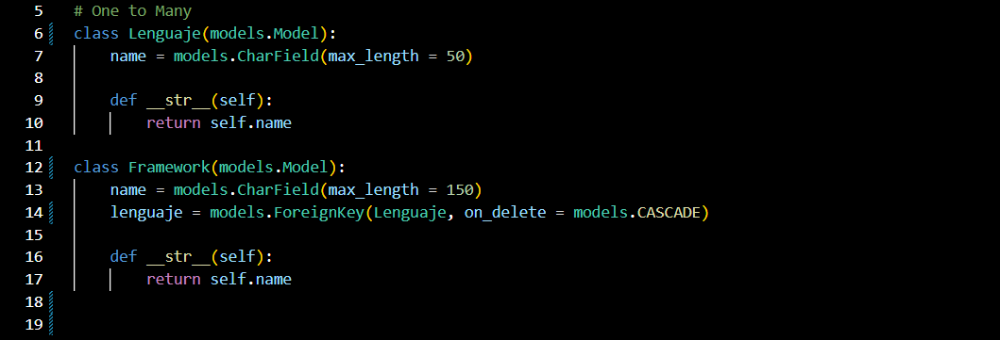
    - Agregar y Consultas: Para agregar y consultar en la DB, se hizo las respectivas migraciones y se abrio un shell donde se importa las clases de Lenguaje y Framework. Posterior a ello se crean objetos de las clases importadas, se guardan en la base de datos y se relacionan a los frameworks con sus respectivos lenguajes. Para realizar consultas, se utiliza "objects.filter" para Lenguaje y Framework especificandose el nombre o inicio de nombre en los parametros para hacer el filtrado y obtener la información solicitada.
    - 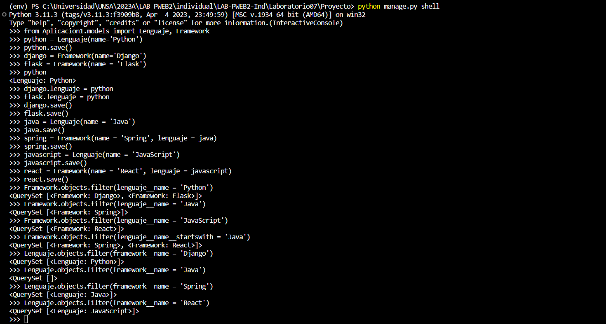
    - Tabla de Lenguajes: En la siguiente imagen se muestra la tabla de Lenguajes despues de agregar la información a la base de datos en el shell, para ello se utilizo DB Browser for SQLite.
    - 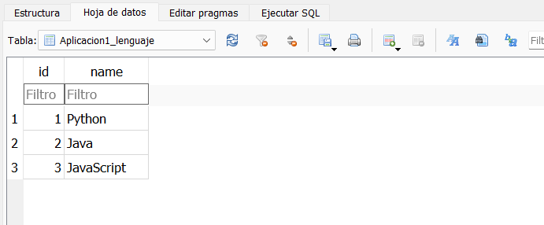
    - Tabla de Frameworks: En la siguiente imagen se muestra la tabla de Framewoks despues de agregar la información a la base de datos en el shell, para ello se utilizo DB Browser for SQLite. Y se puede evidenciar la relación de uno a muchos en la columna "lenguaje_id".
    - 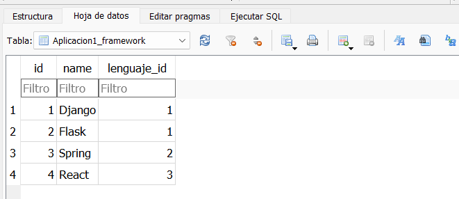

  - Relación muchos a muchos
    - Código: Para realizar la relación de muchos a muchos en bases de datos de Django, se inspeccionaron los videos del Laboratorio y se creo una version similar. Donde se tiene a la Clase Movie (pelicula) y Character (personaje), en la cual las peliculas pueden tener varios personajes y los personajes pueden pertenecer a varias peliculas, se utiliza "models.ManyToManyField()" para hacer la relacion de muchos a muchos.
    - 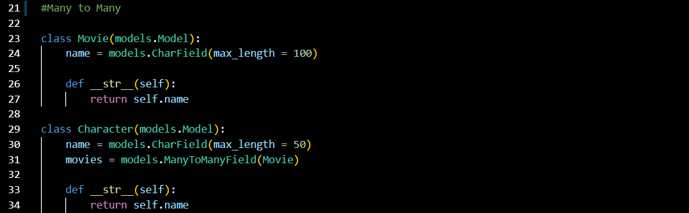
    - Agregar y Consultas: Para agregar y consultar en la DB, se hizo las respectivas migraciones y se abrio un shell donde se importa las clases de Movie y Character. Posterior a ello se crean objetos de las clases importadas, se guardan en la base de datos con ".save()" y se relacionan a los Character con sus respectivas Movie utilizando ".add()" o creandolo directamente con ".create()". Para realizar consultas, se utiliza "objects.filter" para Movie y Character especificandose el nombre en los parametros para hacer el filtrado y obtener la información solicitada.
    - 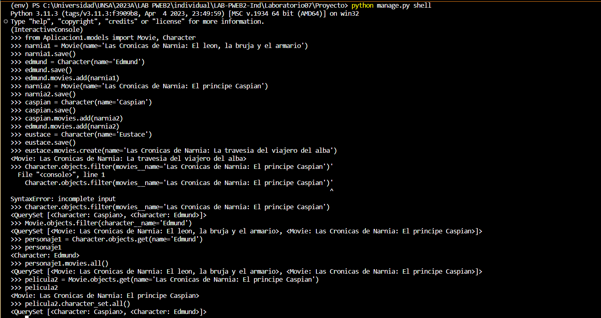
    - Tabla de Movie: En la siguiente imagen se muestra la tabla de Movie despues de agregar la información a la base de datos en el shell, para ello se utilizo DB Browser for SQLite.
    - 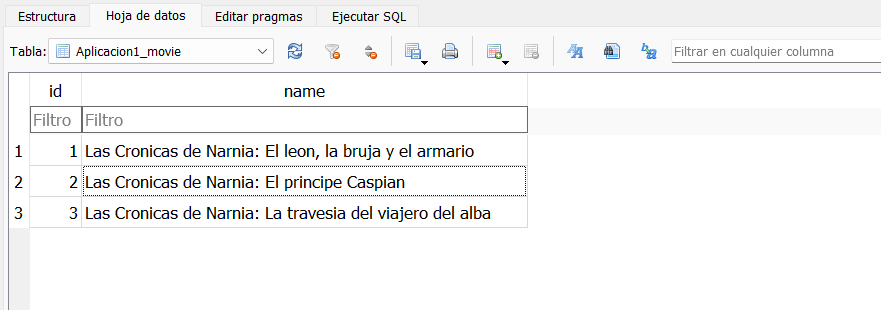
    - Tabla de Character: En la siguiente imagen se muestra la tabla de Character despues de agregar la información a la base de datos en el shell, para ello se utilizo DB Browser for SQLite.
    - 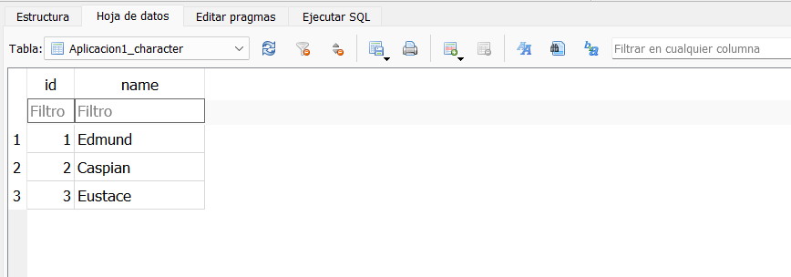
    - Tabla de Movie_Character: En la siguiente imagen se puede evidenciar la relacion de muchos a muchos de Movie y Character, para ello se tiene las columnas de "movie_id" y "character_id". Esta tabla se crea automaticamente despues de migrar con la relacion Many To Many.
    - 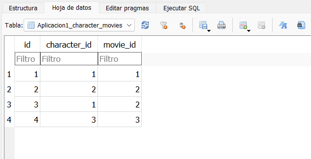

      
  - Impresión de pdfs
    - Codigo: Para realizar la impresion de Pdf en Django, se inspecciono el video del Laboratorio y se ejecuto el siguiente comando en la consola "pip install --pre xhtml2pdf" para poder trabajar con PDFs en Django. En la el archivo "views.py" de Proyecto se importa View, render_to_pdf y get_template, ademas se crea la clase GeneratePDF que capta la plantilla con el nombre "invoice.html" (con la modificacion en settings.py para trabajar con plantillas), se crea un contexto para el template y se renderiza a pdf. En el caso de haberse renderizado, se le otorga un nombre, contenido y al momento de descargar el pdf, se le da un nombre de descarga por defecto.
    - 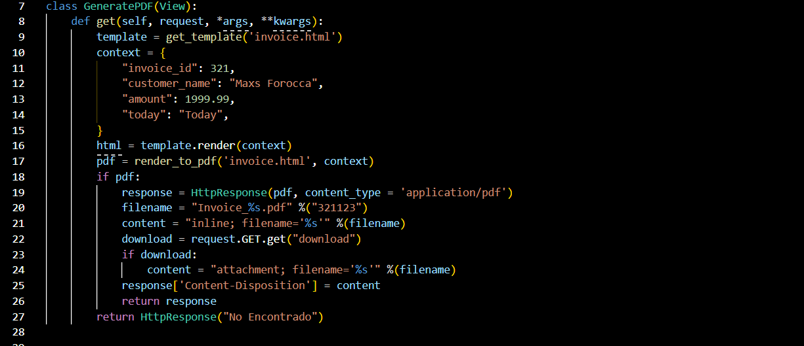
    - Ejecucion: Para mostrar la ejecucion, se otorgo la URL (en urls.py) de "pdf/", donde se muestra la pagina del template Invoice renderizado a pdf.
    - 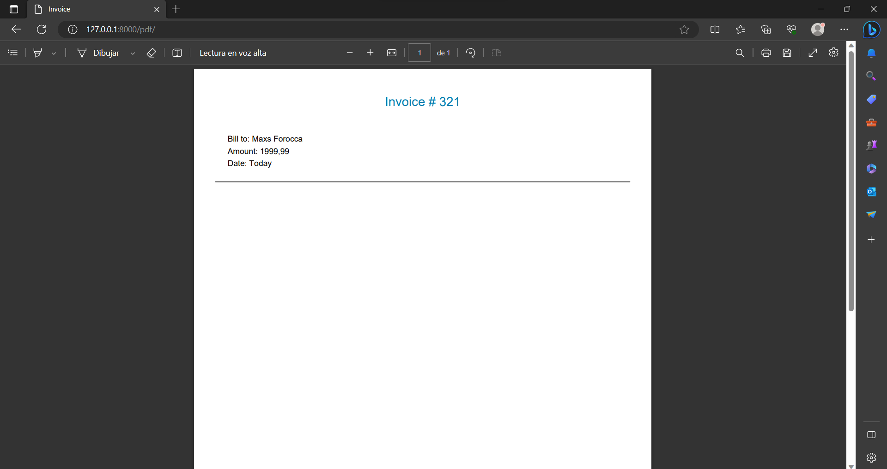
    - Descarga: Al momento de querer descargar el Pdf, se puede evidenciar el nombre por defecto del archivo Pdf.
    - 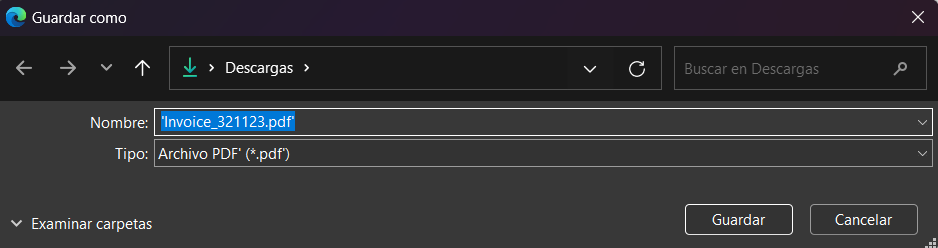
   
      
  - Envio de emails
    - Codigo: Para realizar el envio de Emails en Django, se inspecciono el video del Laboratorio y se creo la aplicacion: "send". En el archivo views.py de la aplicacion se importo send_mail y se creo la funcion index, que utilizara send_mail para enviar un mensaje email, en el primer campo se indica el asunto, en el segundo el contenido y dentro de corchetes, en forma de String se coloca el correo que recibira el mensaje. Para ello se utilizo un correo temporal de la pagina "temp-mail". Finalmente se enviara el template index.
    - 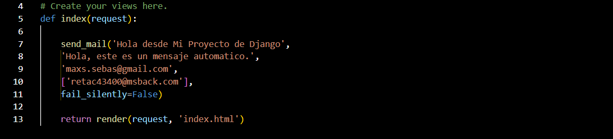
    - Settings: Para poder enviar un Email desde Django, se agrego a settings.py el host, puerto, ssl, tls, correo y contraseña.
    - 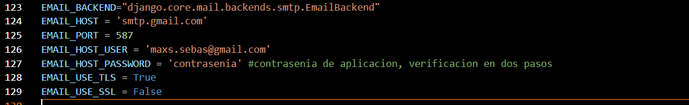
    - Envio: Al momento de correr el servidor, y dirigirse a la ruta por defecto (se especifico en urls.py para enviar el email), se muestra el template index mostrando el mensaje de que se envio al correo.
    - 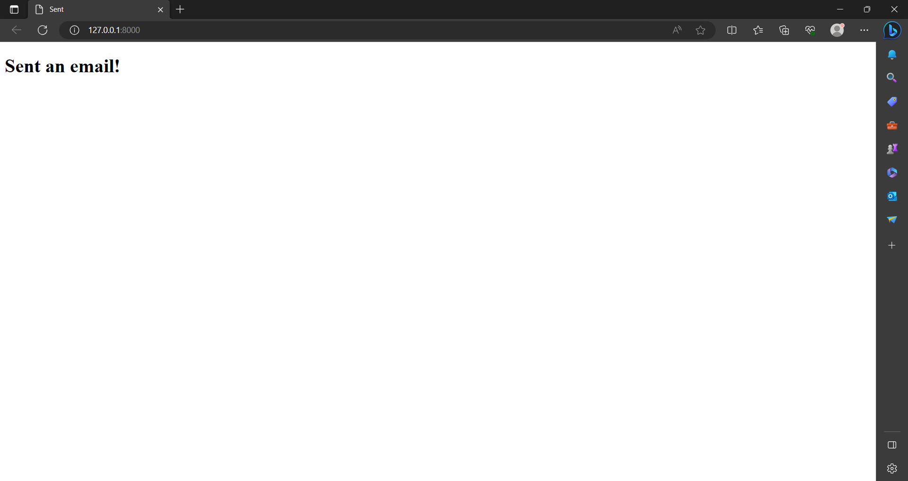
    - Recepcion: Cuando nos dirigimos al correo temporal se puede evidenciar que se recivio exitosamente el correo enviado desde Django.
    - 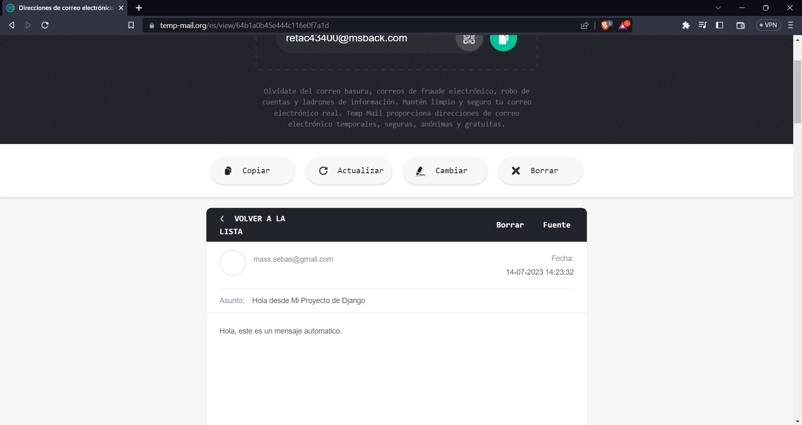
   
       
  - Commits
    - Commits importantes al momento de realizar el laboratorio.
    - 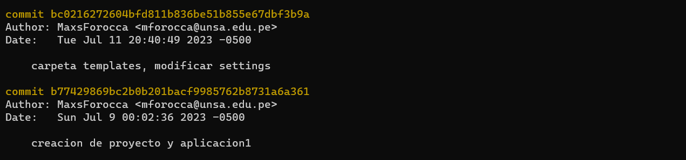
    - 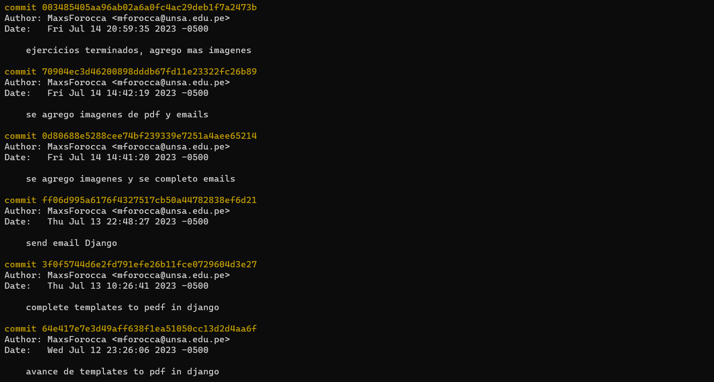
#

## CUESTIONARIO

#

## REFERENCIAS

#
